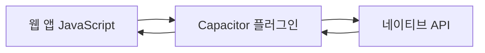

# Capacitor 플러그인 사용 가이드
**버전: v7**

WebView와 Capacitor 런타임은 **Capacitor 플러그인**을 통해 통신합니다. 플러그인은 웹 앱에서 카메라, 위치정보, 파일시스템 접근과 같은 **네이티브 API**에 접근할 수 있게 해줍니다.

---

## 🚀 Capacitor 플러그인이란?

### 💡 핵심 개념
Capacitor 플러그인은 웹 코드와 네이티브 코드 사이의 **다리 역할**을 합니다. JavaScript에서 네이티브 디바이스 기능을 직접 호출할 수 있게 해주는 중간 계층입니다.

### 🔧 플러그인의 역할


| 웹 앱 요청 | 플러그인 | 네이티브 API |
|----------|---------|-------------|
| `Camera.getPhoto()` | Camera 플러그인 | iOS/Android 카메라 |
| `Geolocation.getCurrentPosition()` | Geolocation 플러그인 | GPS 센서 |
| `Filesystem.writeFile()` | Filesystem 플러그인 | 파일 시스템 |

---

## 📦 공식 Capacitor 플러그인

### 🏆 Capacitor 팀 공식 지원
Capacitor 팀은 일반적으로 사용되는 API를 위한 [공식 플러그인 세트](https://capacitorjs.com/docs/apis)를 유지관리합니다.

### 🌟 주요 공식 플러그인들

#### 📱 디바이스 기능
| 플러그인 | 용도 | 예시 사용 |
|---------|------|----------|
| **[@capacitor/camera](https://capacitorjs.com/docs/apis/camera)** | 카메라, 갤러리 접근 | 프로필 사진 촬영 |
| **[@capacitor/geolocation](https://capacitorjs.com/docs/apis/geolocation)** | GPS 위치 정보 | 지도 앱, 위치 기반 서비스 |
| **[@capacitor/device](https://capacitorjs.com/docs/apis/device)** | 디바이스 정보 | 디바이스 모델, OS 버전 확인 |

#### 🎵 미디어 & 센서
| 플러그인 | 용도 | 예시 사용 |
|---------|------|----------|
| **[@capacitor/haptics](https://capacitorjs.com/docs/apis/haptics)** | 햅틱 피드백(진동) | 버튼 탭 피드백 |
| **[@capacitor/motion](https://capacitorjs.com/docs/apis/motion)** | 가속도계, 자이로스코프 | 게임, 피트니스 앱 |

#### 💾 저장소 & 통신
| 플러그인 | 용도 | 예시 사용 |
|---------|------|----------|
| **[@capacitor/filesystem](https://capacitorjs.com/docs/apis/filesystem)** | 파일 시스템 접근 | 파일 저장, 읽기 |
| **[@capacitor/share](https://capacitorjs.com/docs/apis/share)** | 네이티브 공유 | 콘텐츠 공유 기능 |
| **[@capacitor/push-notifications](https://capacitorjs.com/docs/apis/push-notifications)** | 푸시 알림 | 실시간 알림 서비스 |

### 📚 자세한 정보
[Capacitor 플러그인 전체 목록 보기 ›](https://capacitorjs.com/docs/plugins)

---

## 🌍 Capacitor 커뮤니티 플러그인

### 💪 활발한 커뮤니티 생태계
[Capacitor Community](https://github.com/capacitor-community/)에서는 대규모 Capacitor 플러그인 세트를 제공합니다.

### 🎯 커뮤니티 플러그인 특징
- **높은 품질**: 엄격한 코드 리뷰와 테스트
- **활발한 유지보수**: 정기적인 업데이트
- **다양한 기능**: 공식 플러그인으로 커버되지 않는 특수 기능들

### 🌟 인기 커뮤니티 플러그인들

#### 📱 고급 디바이스 기능
- **[@capacitor-community/barcode-scanner](https://github.com/capacitor-community/barcode-scanner)** - QR/바코드 스캐너
- **[@capacitor-community/bluetooth-le](https://github.com/capacitor-community/bluetooth-le)** - 블루투스 저전력 통신
- **[@capacitor-community/sqlite](https://github.com/capacitor-community/sqlite)** - SQLite 데이터베이스

#### 🎨 UI/UX 향상
- **[@capacitor-community/native-audio](https://github.com/capacitor-community/native-audio)** - 네이티브 오디오 재생
- **[@capacitor-community/screen-brightness](https://github.com/capacitor-community/screen-brightness)** - 화면 밝기 제어

### 💡 플러그인 제안하기
새로운 플러그인 아이디어가 있다면 [Capacitor Community 제안 저장소](https://github.com/capacitor-community/proposals/)를 사용하세요.

---

## 🔧 플러그인 설치 및 사용 예시

### 📦 설치 과정

#### 1️⃣ NPM으로 설치
```bash
npm install @capacitor/camera
```

#### 2️⃣ 네이티브 프로젝트 동기화
```bash
npx cap sync
```

#### 3️⃣ 코드에서 사용
```typescript
import { Camera, CameraResultType, CameraSource } from '@capacitor/camera';

const takePicture = async () => {
  const photo = await Camera.getPhoto({
    resultType: CameraResultType.Uri,
    source: CameraSource.Camera,
    quality: 90
  });
  
  console.log('사진 경로:', photo.webPath);
};
```

### 🎯 실제 사용 예시

#### 📷 카메라 플러그인 활용
```typescript
// React 컴포넌트에서 카메라 사용
import React, { useState } from 'react';
import { Camera, CameraResultType } from '@capacitor/camera';

const PhotoCapture = () => {
  const [photo, setPhoto] = useState<string>();

  const takePhoto = async () => {
    try {
      const result = await Camera.getPhoto({
        resultType: CameraResultType.DataUrl,
        quality: 90
      });
      
      setPhoto(result.dataUrl);
    } catch (error) {
      console.error('사진 촬영 실패:', error);
    }
  };

  return (
    <div>
      <button onClick={takePhoto}>📷 사진 찍기</button>
      {photo && }
    </div>
  );
};
```

#### 📍 위치 정보 플러그인 활용
```typescript
import { Geolocation } from '@capacitor/geolocation';

const getCurrentLocation = async () => {
  try {
    const position = await Geolocation.getCurrentPosition();
    
    console.log('현재 위치:');
    console.log('위도:', position.coords.latitude);
    console.log('경도:', position.coords.longitude);
    console.log('정확도:', position.coords.accuracy, 'm');
  } catch (error) {
    console.error('위치 정보 가져오기 실패:', error);
  }
};
```

---

## 🔄 Cordova 플러그인 호환성

### 🤝 기존 자산 활용
Capacitor와 정확히 일치하는 웹 API나 Capacitor 플러그인을 찾을 수 없나요? 또는 [Cordova에서 Capacitor로 마이그레이션](https://capacitorjs.com/docs/cordova/migration-strategy) 중이신가요?

### ⚡ Cordova 호환성 레이어

#### 🎯 핵심 특징
- **호환성 레이어**: Cordova 플러그인 기능을 모방하려고 시도
- **광범위한 지원**: 대부분의 Cordova 플러그인과 호환
- **추가 설정**: 설치 시 추가 단계가 필요할 수 있음

#### ⚠️ 주의사항
```bash
# Cordova 플러그인 설치 시
npm install cordova-plugin-example
npx cap sync

# 추가 네이티브 설정이 필요할 수 있습니다
```

### 📚 자세한 가이드
[Capacitor 앱에서 Cordova 플러그인 사용하기 ›](https://capacitorjs.com/docs/plugins/cordova)

---

## 🛠 개발 팁 & 모범 사례

### ✅ 플러그인 선택 가이드

#### 🏆 우선 순위
1. **공식 Capacitor 플러그인** (최고 우선순위)
2. **Capacitor Community 플러그인** (높은 신뢰성)
3. **Cordova 플러그인** (호환성 확인 필요)
4. **직접 개발** (마지막 수단)

#### 🔍 플러그인 평가 기준
| 기준 | 확인사항 |
|------|----------|
| **활발한 유지보수** | 최근 커밋, 이슈 응답 |
| **Capacitor 버전 호환성** | 현재 사용 중인 Capacitor 버전 지원 |
| **문서화 품질** | 명확한 설명과 예시 |
| **커뮤니티 피드백** | GitHub 스타, 이슈 수 |

### 🚨 일반적인 실수들

#### ❌ 피해야 할 것들
1. **플러그인 미동기화**: `npx cap sync` 실행 누락
2. **권한 설정 누락**: iOS Info.plist, Android 권한 설정
3. **에러 처리 부족**: try-catch 문 사용하지 않음

#### ✅ 권장사항
```typescript
// 좋은 예시: 에러 처리와 권한 확인
import { Camera, CameraResultType } from '@capacitor/camera';

const safeTakePhoto = async () => {
  try {
    // 권한 확인 (선택적)
    const permissions = await Camera.checkPermissions();
    if (permissions.camera !== 'granted') {
      await Camera.requestPermissions();
    }
    
    // 사진 촬영
    const photo = await Camera.getPhoto({
      resultType: CameraResultType.Uri,
      quality: 90
    });
    
    return photo;
  } catch (error) {
    console.error('카메라 오류:', error);
    throw new Error('사진을 촬영할 수 없습니다.');
  }
};
```

---

## 🎯 요약

### 🔑 핵심 포인트
1. **플러그인은 필수**: 네이티브 기능 접근을 위해 반드시 필요
2. **공식 우선**: 공식 플러그인을 먼저 확인
3. **커뮤니티 활용**: 필요한 기능이 없다면 커뮤니티 플러그인 검토
4. **Cordova 호환**: 기존 Cordova 자산도 활용 가능

### 🚀 다음 단계
- [전체 플러그인 API 문서](https://capacitorjs.com/docs/apis) 탐색
- [플러그인 개발 가이드](https://capacitorjs.com/docs/plugins/creating-plugins) 학습
- [커뮤니티](https://github.com/capacitor-community/)에서 유용한 플러그인 찾기

Capacitor 플러그인을 활용하여 강력한 네이티브 앱 경험을 만들어보세요! 🎉